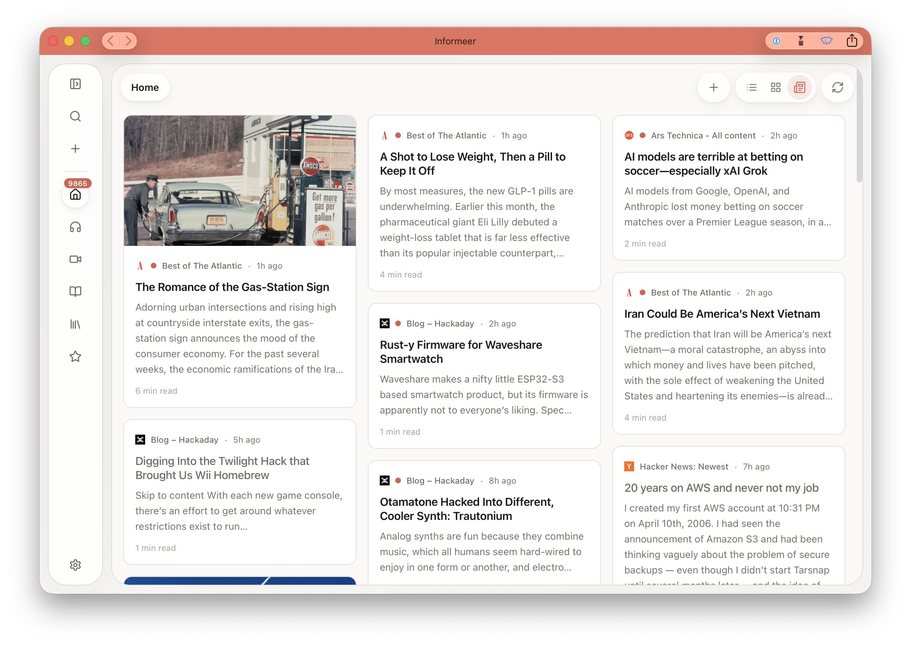
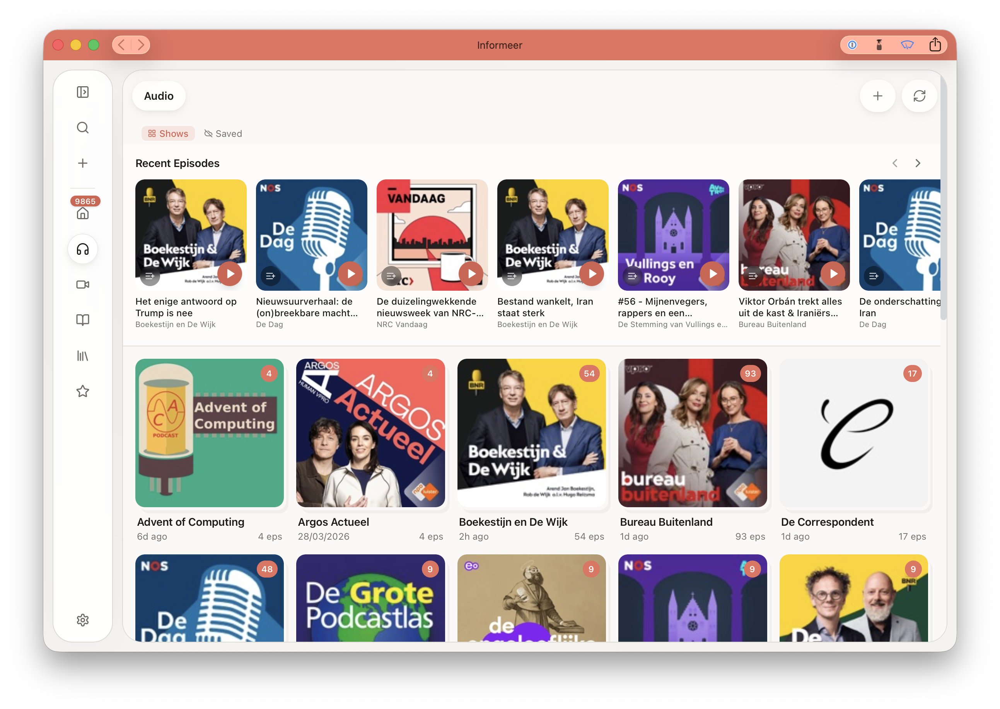
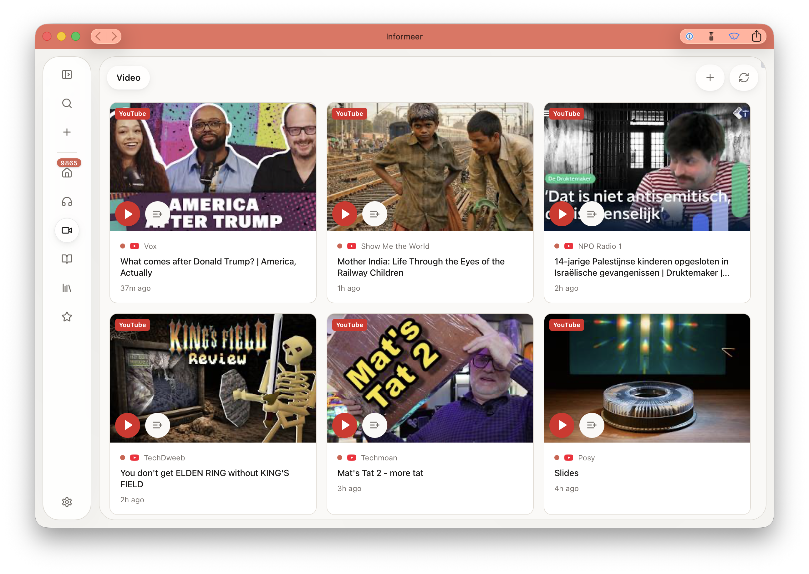
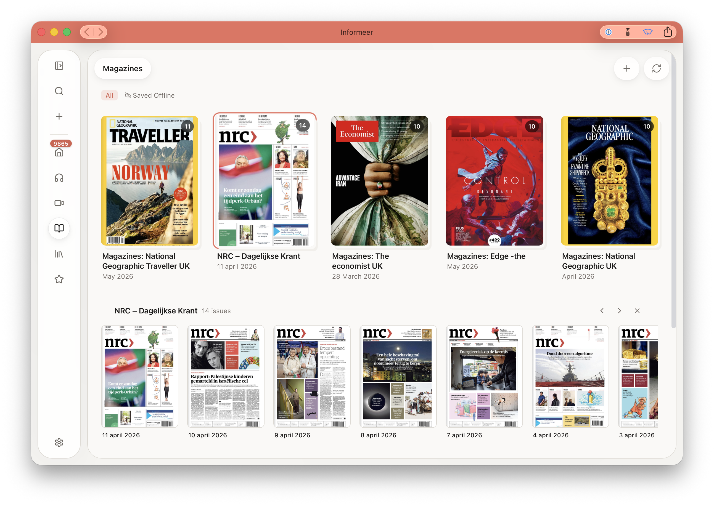
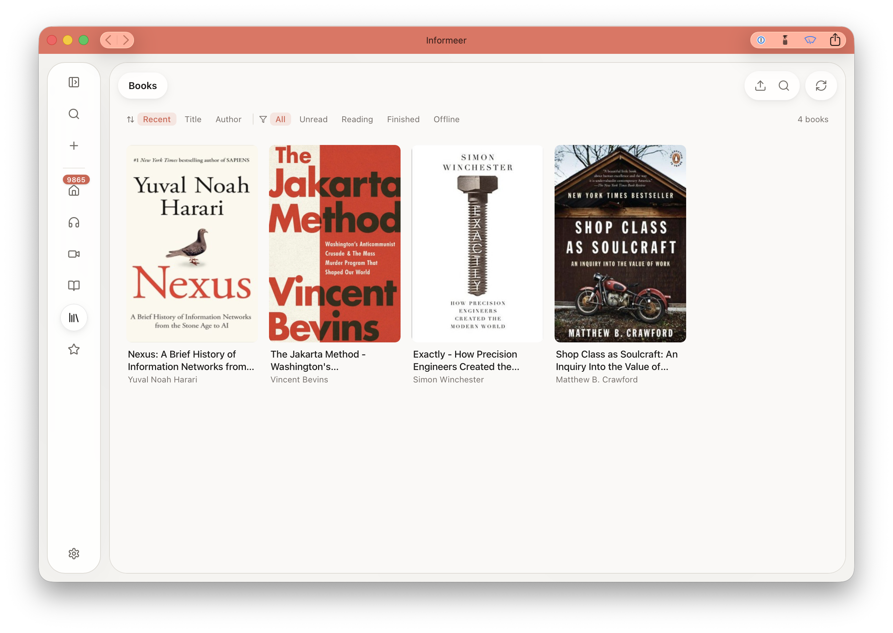
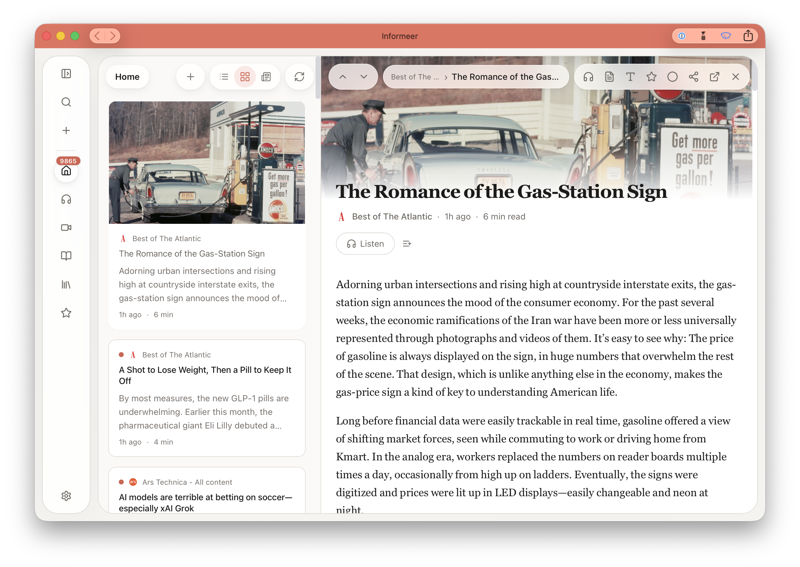

# Informeer

> **A self-hosted reading room for feeds, podcasts, YouTube, magazines, newspapers, and books.**

[](LICENSE)

Informeer is a self-hosted media and reading application built for people who want one place to consume information intentionally. It combines feed reading, full-text article extraction, podcast playback, YouTube subscriptions, magazine PDFs, EPUB books, search, offline support, and local-first reading workflows in a single app you control.

<p align="center">
  
</p>

## Screenshots

| | |
|---|---|
|  |  |
| **Home Feed** — The main view showing articles from all subscribed feeds in a multi-column card layout, with source icons, publication timestamps, and estimated read times. | **Podcasts** — The audio library displaying subscribed podcast shows as cover art tiles, with recent episodes and progress indicators. |
|  |  |
| **Video Feed** — YouTube subscriptions presented as a clean video grid with thumbnails and channel names, without algorithmically recommended noise. | **Magazines & Newspapers** — The magazine view with recent issue covers grouped by publication, including PDF-backed magazine back-issues and daily newspaper editions. |
|  |  |
| **Books Library** — Imported EPUB books shown as a cover grid with reading-state filters (All / Unread / Reading / Finished / Offline). | **Article Reader** — The split-pane reading view with the feed list on the left and a full-text article open on the right, including TTS, bookmarking, and sharing controls. |

## Features

- **Feed Reading** — Subscribe to RSS, Atom, and JSON Feed sources with clean article reading and full-text extraction
- **Podcasts** — Built-in audio player, queue support, progress sync, and offline episode saving
- **YouTube Without the Noise** — Follow subscribed channels in the same interface without the usual recommendation clutter
- **Magazine PDFs** — Read issues in a dedicated PDF viewer with spread handling, progress sync, and offline saving
- **Books** — Import EPUB files and read them in the built-in reader with progress memory and reader settings
- **Search** — Search titles, authors, URLs, and extracted content with SQLite FTS5
- **Offline-Aware** — Install as a PWA, cache content locally, and keep reading through unreliable connectivity
- **Single Deployable App** — One Docker image, one exposed port, Bun backend plus bundled frontend

## Tech Stack

| Layer | Technology |
|-------|-----------|
| Frontend | React 19, Vite 6, TypeScript, Tailwind CSS 4 |
| Routing | TanStack Router |
| State | Zustand 5 |
| Reader Features | pdf.js, epub.js, browser-based TTS |
| Backend | Bun, Hono, SQLite, FTS5 |
| Security | HTTP Basic Auth, bcrypt, AES-256-GCM |
| Deploy | Docker, Docker Compose |

## Quick Start

### Development

```bash
# Clone the repo
git clone https://github.com/jessevl/Informeer.git
cd Informeer

# Install dependencies
cd api && bun install && cd ..
cd frontend && npm install && cd ..

# Install the repo-local git hook guardrail
npm run hooks:install

# Start API and frontend together
npm run dev
```

Development services:

- Frontend: `http://localhost:5173`
- API: `http://localhost:3011`

The Vite dev server proxies API requests to the Bun backend automatically.

`npm run hooks:install` enables the repo-local pre-push hook and `push.recurseSubmodules=check`, which helps prevent accidental `frontend/src/frameer` submodule pointer changes.

### Production (Docker)

```bash
# Clone the repo
git clone https://github.com/jessevl/Informeer.git
cd Informeer

# Create local environment config
cp .env.example .env

# Edit .env and set at least these values:
# SECRET_KEY=$(openssl rand -hex 32)
# ADMIN_PASSWORD=change-this-now

# Build and start
docker compose up -d --build
```

Informeer is then available at `http://localhost:3011`.

Default login:

- Username: `admin`
- Password: the value you set in `ADMIN_PASSWORD`

Production note:

- Set `SECRET_KEY` explicitly
- Set `ADMIN_PASSWORD` explicitly
- Do not expose the app publicly with development defaults

## CI/CD

GitHub Actions currently handles validation, container publishing, and releases from the monorepo:

- Pushes and pull requests to `main` run frontend type-check and build validation
- Pushes and pull requests to `main` run API type-check and tests
- Pull requests to `main` also validate the Docker build
- Pushes to `main` and version tags publish a container image to `ghcr.io`
- Pushes to `main` trigger the release workflow, which can bump `VERSION`, create a GitHub Release, and publish versioned container tags
- Workflow dispatch supports manual `patch`, `minor`, and `major` release bumps

Workflows live in:

- [.github/workflows/ci.yml](.github/workflows/ci.yml)
- [.github/workflows/docker-publish.yml](.github/workflows/docker-publish.yml)
- [.github/workflows/release.yml](.github/workflows/release.yml)

Release flow:

```bash
# Patch releases can be handled automatically by the release workflow on main.

# For a manual minor or major bump, update VERSION first
echo "0.2.0" > VERSION
git commit -am "Bump version to 0.2.0"

# Then push to main, or trigger the workflow manually
git push origin main
```

## Repository Structure

```text
Informeer/
├── api/                    # Bun + Hono backend, feed engine, search, source integrations
│   ├── src/
│   │   ├── db/             # SQLite connection, migrations, seeding
│   │   ├── lib/            # Crypto, logging, OPML, HTML, HTTP helpers
│   │   ├── middleware/     # Auth, request logging, rate limiting
│   │   ├── routes/         # REST API endpoints
│   │   ├── services/       # Extraction, scheduler, settings, discovery
│   │   └── sources/        # RSS, NRC, MagazineLib, and other source adapters
│   └── tests/              # API, service, source, and helper tests
│
├── frontend/               # React PWA frontend
│   ├── src/
│   │   ├── api/            # Client API layer
│   │   ├── components/     # Reader, player, layout, magazines, books, settings
│   │   ├── hooks/          # Connectivity, scroll, reader, sync hooks
│   │   ├── routes/         # App routes
│   │   ├── stores/         # Zustand state stores
│   │   ├── styles/         # Theme tokens and global styles
│   │   └── frameer/        # Shared UI library submodule
│   └── public/             # Icons, manifest, static assets
│
├── .github/workflows/      # CI, container publishing, release automation
├── Dockerfile              # Multi-stage build for frontend + API
├── docker-compose.yml      # Local production-style deployment
├── VERSION                 # Release version source of truth
└── package.json            # Root dev/build/test orchestration
```

## Architecture

Informeer is a two-part application:

1. The Bun backend fetches and normalizes feeds, extracts full article content, stores entries and settings in SQLite, indexes content for search, and tracks reading and playback progress.
2. The React frontend presents the archive as an installable PWA with dedicated reading, listening, video, magazine, and book workflows.

Core data flow:

1. Add a feed, source, or imported item
2. The backend fetches, parses, and stores entries locally
3. Search indexes, icons, metadata, and extracted content are updated
4. The frontend reads that state through the API and caches parts of it locally
5. Reading progress, playback progress, bookmarks, and settings sync back through the backend

Key architectural characteristics:

- **SQLite-first** — no separate database service required
- **Source adapters** — RSS, podcasts, magazines, newspapers, and book workflows use dedicated parsing paths where needed
- **Offline-aware frontend** — PWA installability, local caching, and explicit offline saves for heavier media like PDFs and audio
- **Single container deployment** — the production image serves both the API and the built frontend on port `3011`

## Commands

```bash
# Development
npm run dev              # Start API and frontend together
npm run dev:api          # Start Bun API only
npm run dev:frontend     # Start Vite frontend only
npm run hooks:install    # Install local git hook protections

# Build
npm run build            # Build frontend and API
npm run build:frontend   # Build frontend only
npm run build:api        # Build API only

# Test and type-check
npm test                 # Run API tests
npm run typecheck        # Type-check frontend and API

# Docker
npm run docker:build     # Build Docker image via Compose
npm run docker:up        # Start container stack
npm run docker:down      # Stop container stack
```

## Documentation

| Document | Description |
|----------|-------------|
| [api/README.md](api/README.md) | Backend overview, API features, environment, and route summary |
| [api/BACKEND_PLAN.md](api/BACKEND_PLAN.md) | Backend architecture and planning notes |
| [frontend/README.md](frontend/README.md) | Frontend-specific development notes and project structure |
| [frontend/PRD.md](frontend/PRD.md) | Product requirements and UI goals for the frontend |
| [.env.example](.env.example) | Example environment file for local and production setup |

## License

This project is licensed under the [GNU Affero General Public License v3.0 or later](LICENSE).

- You can use, modify, and distribute this software freely
- If you deploy a modified version as a network service, you must make the source available under the same license
- Modifications must also remain under AGPL-compatible terms
